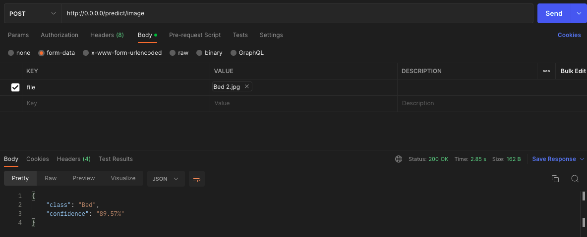

# Furniture Classification

This repository contains the code for a furniture classification project, which aims to differentiate between three different types of furniture: bed, chair, and sofa. The purpose of this project is to provide a reliable and accurate method for classifying furniture images using deep learning techniques.

## Dataset

The dataset used in this project contains 300 images of furniture, with 100 images per class (bed, chair, and sofa). We split the dataset into a training set and a validation set. We used 80% of the images for training and the remaining 20% for validation. To ensure that the model generalizes well and to prevent overfitting, we applied data augmentation techniques such as rotation and flipping.

## Result

In this project, we used convolutional neural networks (CNNs) for furniture classification and experimented with different model architectures, including ResNet, VGG, and Transformers. To optimize the models, we used the cross-entropy loss function and the Adam optimizer. We trained the models for 20 epochs and used early stopping to prevent overfitting. Note that since the number of samples within the dataset is limited, only the fully connected part of the networks are optimized.

The following table presents the classification performance of several deep learning models on the validation data. The performance is evaluated based on several metrics, including bed accuracy, chair accuracy, sofa accuracy, Kappa, F1 score, area under the receiver operating characteristic curve (AUC), and balanced accuracy.

| Model       | Bed Acc. | Chair Acc. | Sofa Acc. | Kappa   | F1 Score | AUC     | Balanced Acc. |
|-------------|----------|------------|-----------|---------|----------|---------|---------------|
| ResNet18    | 90.00%   | 95.00%     | 90.00%    | 0.8750   | 0.9170  | 0.9787        | 91.67%        |
| ResNet34    | 100.00%  | 90.00%     | 100.00%   | 0.9500   | 0.9666  | 0.9933        | 96.67%        |
| ResNet50    | 95.00%   | 95.00%     | 95.00%    | 0.9250   | 0.9504  | 0.9929        | 95.00%        |
| ResNext50   | 100.00%  | 95.00%     | 90.00%    | 0.9250   | 0.9496  | 0.9896        | 95.00%        |
| ResNext101  | 100.00%  | 100.00%    | 75.00%    | 0.8750   | 0.9133  | 0.9796        | 91.67%        |
| VGG16       | 100.00%  | 100.00%    | 95.00%    | 0.9750   | 0.9833  | 0.9979        | 98.33%        |
| VGG16_bn    | 85.00%   | 100.00%    | 95.00%    | 0.9000   | 0.9331  | 0.9896        | 93.33%        |
| VGG19       | 95.00%   | 100.00%    | 80.00%    | 0.8750   | 0.9151  | 0.9883        | 91.67%        |
| VGG19_bn    | 95.00%   | 100.00%    | 85.00%    | 0.9000   | 0.9331  | 0.9654        | 93.33%        |
| **Transformer** | **100.00%**  | **100.00%**    | **100.00%**   | **1.0000**   | **1.0000** | **1.0000**        | **100.00%**       |

Overall, the results show that deep learning models are capable of achieving high accuracy on the furniture object classification task, with the Transformer-based model being the best performing model.

Table 2 provides information about the computational resources required for each of the evaluated models. The second column indicates the number of parameters that were trained during the training process, while the third column shows the total number of parameters in the model. The last column displays the FLOPS (floating-point operations per second) required for the model, which is a measure of the computational workload. These metrics can be useful in determining the trade-off between model complexity and computational cost, and can help inform decisions regarding model selection and optimization for specific applications.

| Model       | # Parameters | Total Parameters | FLOPs        |
|-------------|--------------|------------------|--------------|
| ResNet18    | 1539         | 11.18M            | 1.83B        |
| ResNet34    | 1539         | 21.29M            | 3.68B        |
| ResNet50    | 6147         | 23.51M            | 4.14B        |
| ResNext50   | 6147         | 22.99M            | 4.30B        |
| ResNext101  | 6147         | 86.75M            | 16.57B       |
| VGG16       | 12291        | 134.27M           | 15.47B       |
| VGG16_bn    | 12291        | 134.28M           | 15.53B       |
| VGG19       | 12291        | 139.58M           | 19.63B       |
| VGG19_bn    | 12291        | 139.59M           | 19.70B       |
| Transformer | 2307         | 115.37M           | 23.23B       |

## API

The trained network was wrapped in an API (Application Programming Interface) using FastAPI and Docker. The API accepts an input image and returns the predicted furniture category along with its corresponding probability. It provides a user-friendly interface for interacting with the trained network and obtaining real-time predictions.

## Requirements

The code requires the following packages to be installed:

* Docker

Please note that all required dependencies have been pre-installed within the Docker image, and there is no need to install any additional libraries.

## Usage

Due to our privacy and data sharing policy, we are unable to share the data or the code for training the modules. However, we have created a Docker image containing the API code, which has been uploaded to the following [link](https://hub.docker.com/repository/docker/amiiirali/furnitureclassification/general). You can use this image to run the API and make predictions on your own data.

### Testing the API

To test the API, you can use a tool like Postman or simply use your web browser. In this example, we'll illustrate how to use Postman to make a request to the API.

0. Run the docker image by the following command in your terminal: `docker run -p 8000:8000 amiiirali/furnitureclassification`

1. Download and install [Postman](https://www.postman.com/downloads/).

2. Open Postman and create a new request.

3. Set the request method to `POST`.

4. Set the request URL to the API endpoint to `predict/image`.

5. Select the `Body` tab and choose `form-data`.

6. Add a key `file` and choose a furniture image as the value.

7. Send the request, and the API will return the predicted furniture category and its probability.

To evaluate the performance of the network, we tested the API on a [sample image](https://www.thebrick.com/products/oslo-queen-bed), which is not included in the train/validation dataset.

As it is illustrated in the above figure, the network correctly predicts the input image as `Bed` with the probability of `89.57%`.

## License

This project is licensed under the MIT License - see the LICENSE file for details.

## Author

* Amirali

